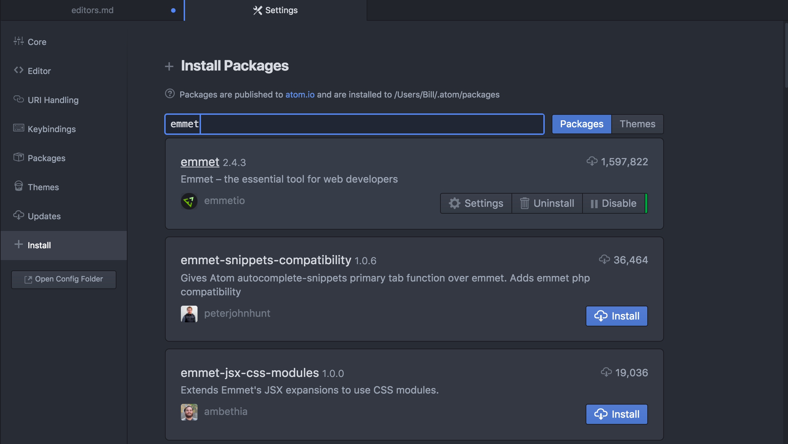
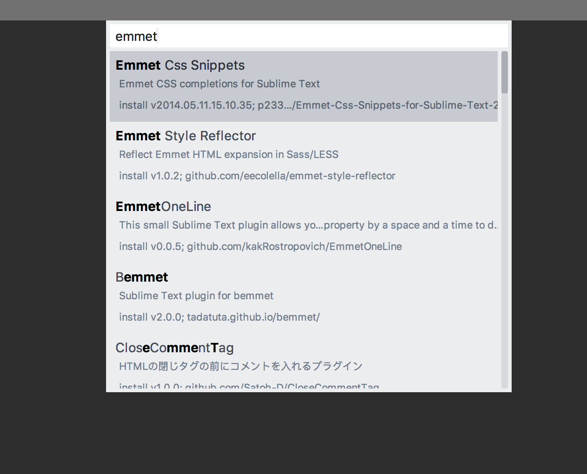
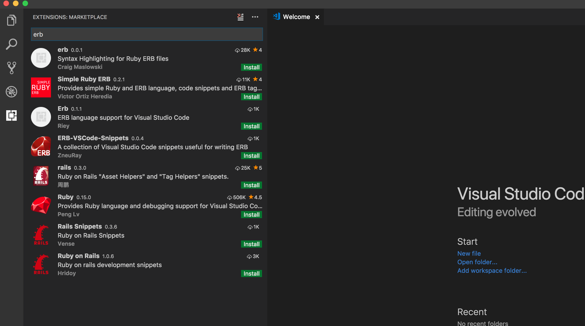

## Text Editors
You will need a text editor to actually write some code. They can all pretty much
do everything you need, so the editor that you choose is really down to personal
preference.

[Article explaining the pro's and con's](https://www.codementor.io/mattgoldspink/best-text-editor-atom-sublime-vim-visual-studio-code-du10872i7)

We would recommend one of the following (these are the editors the mentors know best and so will be able to help with the most):
- [Visual Studio Code](#visual-studio-code)
- [Atom](#atom)
- [Sublime Text](#sublime-text)

## Packages
Packages extend the functionality of your editor. If you can think of it chances are it already exists as a package for the editor.

Recommended packages:
- [Emmet](https://emmet.io/)
- [ERB Snippets](https://atom.io/packages/erb-snippets)

## Atom
https://atom.io/

### Useful Shortcuts
- `Cmd + S` to save the current file.
- Use `Cmd + D` to select the next instance of the highlighted word. You can use this to change multiple things at once.
- Use `Cmd + T` to search for files in the current project.
- [Cheatsheet](https://github.com/nwinkler/atom-keyboard-shortcuts)

### Installing packages
To install packages on Atom simply go to settings `Atom > preferences` (or `cmd + ,`) click on install and then search for and install the package you are looking for.

## Sublime Text
https://www.sublimetext.com/

### Useful shortcuts
- `Cmd + S` to save the current file.
- Use `Cmd + D` to select the next instance of the highlighted word. You can use this to change multiple things at once.
- Use `Cmd + Ctrl + G` to select all instances of the highlighted word in the current file.
- Use `Cmd + P` to search for files in the current project.
- [Cheatsheet](https://www.cheatography.com/tdeyle/cheat-sheets/sublime-text-3/)

### Installing Packages
In order to install packages in Sublime you first need to set up package control. First you need to open the sublime console `View > Show Console` then copy the code from [here](https://packagecontrol.io/installation#st3) into your console and hit enter.

Once that is installed (you may need to close and reopen sublime) you can hit `Cmd + Shift + p` type in Package Control: Install Package and hit enter again. You can now search and install all available packages.

## Visual Studio Code
https://code.visualstudio.com/

### Useful shortcuts
- `Cmd + S` to save the current file.
- Use `Cmd + D` to select the next instance of the highlighted word. You can use this to change multiple things at once.
- Use `Cmd + P` to search for files in the current project.
- [Mac Cheatsheet](https://code.visualstudio.com/shortcuts/keyboard-shortcuts-macos.pdf)
- [Windows Cheatsheet](https://code.visualstudio.com/shortcuts/keyboard-shortcuts-windows.pdf)

### Installing Packages
To install packages in Visual Studio click on the extensions icon in the sidebar. Then simply search and install the extensions you need.

*Visual Studio Code comes with Emmet installed so you don't need to add it as an extension*
